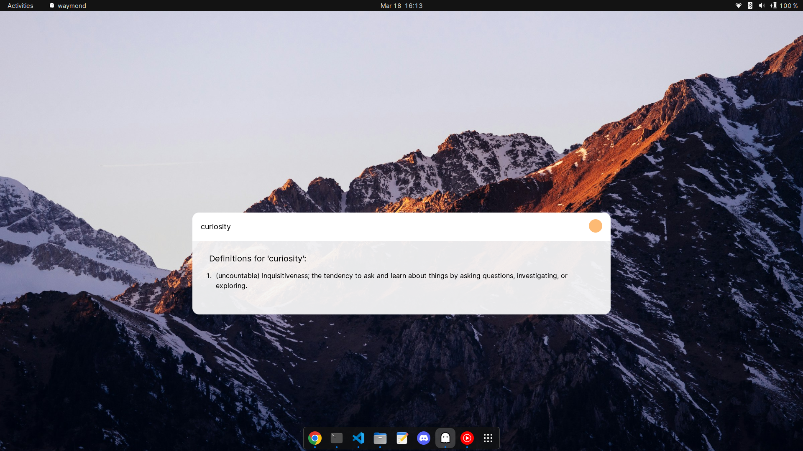

Made a little desktop dictionary app to get familiar with the basics of Tauri.
The UI is insipired by [Spotlight (Apple)](https://en.wikipedia.org/wiki/Spotlight_(Apple)).

(Tauri is a framework for building lightweight, cross-platform desktop apps using rust and web technologies.)

I plan to add web results, app and file search to it as well.

